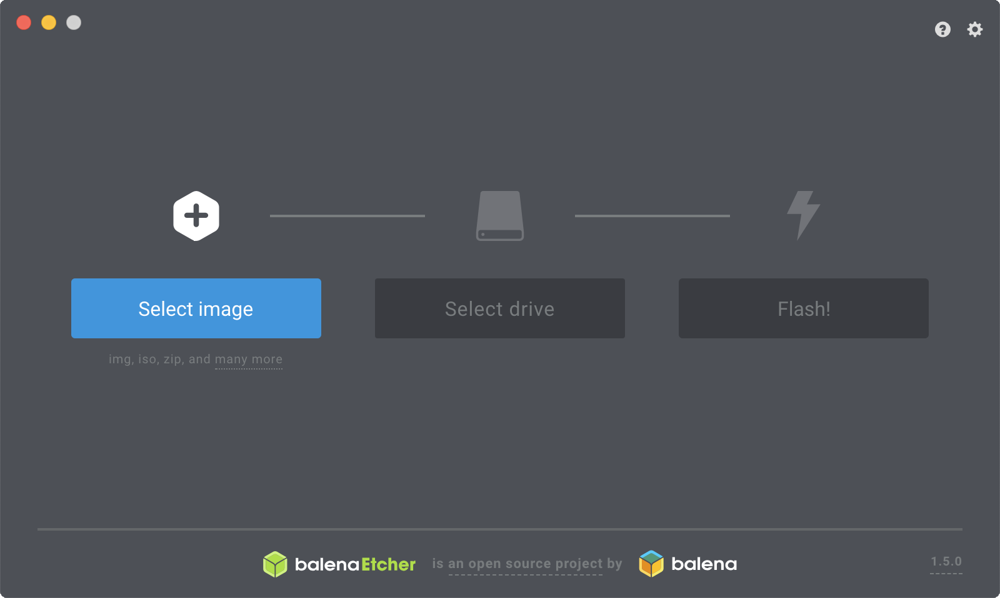

<a href="/texts/">&#8676; Back to texts</a>

	
The Best Mac Programs

	
Version: 0.1 (draft)

	
Last updated: 2019-02-27

# General
## Managing windows: SizeUp
[SizeUp](http://www.irradiatedsoftware.com/sizeup/) is one of those pieces of software that really should come bundled with every copy of MacOS (this is one area where Windows does it better straight out of the box). Just hold down a certain combination of keys and your active window will resize itself and move to the spot of your chosing.

## Flux
[Flux](https://justgetflux.com).

## Monitoring hard drive usage: Space radar
[Space radar](https://github.com/zz85/space-radar/tree/master).

## Etcher
[Etcher](https://github.com/balena-io/etcher).

<figure class="figure">
	
	<figcaption class="figure_caption">Caption for this figure.</figcaption>
</figure>

# Productivity
## Keep track of things: Taskpaper
[Taskpaper](https://www.taskpaper.com).

# Programming
## Text editor: Sublime Text
[Sublime Text](www.duckduckgo.com).
Runner up: [Atom](https://github.com/atom/atom).

## Upload to GitHub: Github Desktop
[Github Desktop](https://desktop.github.com).

# Art
## Create and manipulate images: Affinity Photo and Affinity Designer
[Affinity](https://affinity.serif.com/en-us/).

# Statistics
## jamovi
[jamovi](https://www.jamovi.org)

# Music
## Typesetting music: LilyPond
[LilyPond](http://lilypond.org)
Runner up: [MuseScore](https://musescore.org/en)

<a href="/texts/">&#8676; Back to texts</a>
